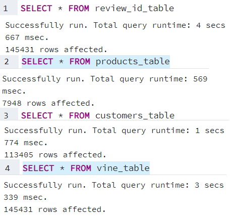
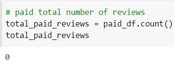
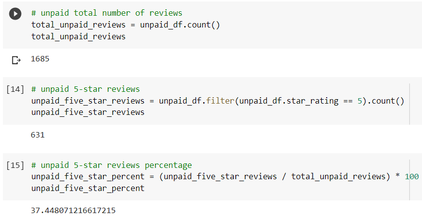

# Amazon_Vine_Analysis

- An analysis of Amazon product reviews from the Amazon Vine program.

# Data Citation

- The dataset used in this analysis is the Digital Video Game Reviews dataset.

"https://s3.amazonaws.com/amazon-reviews-pds/tsv/amazon_reviews_us_Video_Games_v1_00.tsv.gz"

📉The reason for this examination was to utilize PySpark to play out the ETL interaction to remove the dataset, change the information, interface with an AWS RDS occurrence, and burden the changed information into pgAdmin. Then, at that point use PySpark to decide whether there is any inclination toward good surveys from Vine individuals in the Digital Video Game Reviews dataset. 

✔️ The Table_check.png shows that the information was succesfully stacked into pgAdmin.

# Result

- The paid_reviews picture shows the all out number of paid audit in the Digital Video Game Reviews dataset as a feature of the Amazon Vine Program.

- The uppaid_reviews picture show the all out number of uppaid audit in the Digital Video Game Reviews dataset 

#  Total Vine reviews & non-Vine reviews

Vine reviews = 0
non-Vine reviews = 1685

#  Total 5 star Vine reviews & non-Vine reviews

⭐⭐⭐⭐⭐ Vine reviews = 0
⭐⭐⭐⭐⭐ non-Vine reviews = 631

#  Percentage of 5 star Vine reviews & non-Vine reviews

Vine reviews = 0
non-Vine reviews = 37.45%

# Summary

- In view of the outcomes there is no inclination in the Digital Video Game Reviews dataset as there were no paided surveys. 
Computerized Video Game Reviews may have less surveys per item title so consolidating the informational index with the Video Game Reviews dataset (which is the actual release of the item) may offer various outcomes for the quantity of audit and takes part in the Amazon Vine Program.
